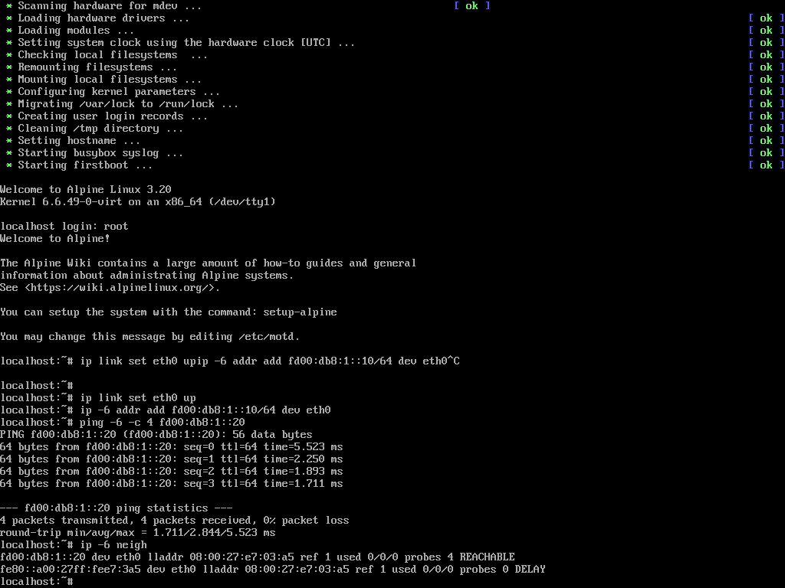
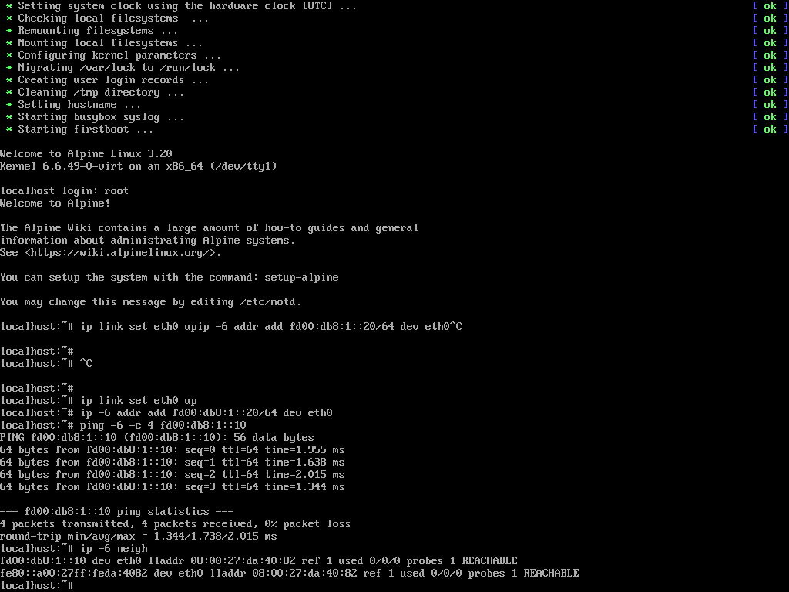

# LAPORAN TUGAS 1 - VIRTUALISASI & KOMUNIKASI JARINGAN IPv6
**Mata Kuliah:** Jaringan Komputer dan LAN (JARKOMLAN)  
**Topik:** Perancangan Lingkungan Virtualisasi Multi-Node (Hypervisor Tipe 2) dan Evaluasi Komunikasi Data Menggunakan Protokol IPv6  

---

## IDENTITAS KELOMPOK
- **Mata Kuliah:** Jaringan Komputer dan LAN
- **Tugas:** Tugas 1 - Virtualisasi & Komunikasi Antar-VM Berbasis IPv6
- **Anggota Kelompok:**
  1. **Nicholas Benaya** — NIM: `5024241050`
  2. **Dzaky Haady** — NIM: `5024241076`
  3. **Alvis Shohan Fawwaz Nizar** — NIM: `5024241019`
  4. **Muhammad Sayyid Tsabit** — NIM: `5024241013`

---

## 1. LANDASAN TEORI & ANALISIS KOMPARASI

### 1.1 Konsep Virtualisasi dan Abstraksi Perangkat Keras
Virtualisasi merupakan teknologi abstraksi yang memisahkan eksekusi perangkat lunak dari lapisan fisik perangkat keras (*hardware abstraction layer*). Melalui teknik ini, sumber daya komputasi fisik tunggal—mencakup Central Processing Unit (CPU), memori fisik (RAM), pengontrol penyimpanan (Storage Controller), dan kartu antarmuka jaringan (Network Interface Card / NIC)—dapat dibagi secara logis menjadi beberapa lingkungan eksekusi terisolasi yang disebut **Virtual Machine (VM)**. Setiap VM beroperasi secara independen dengan sistem operasi tamu (*Guest OS*) dan tumpukan protokol jaringan (*network stack*) mandiri.

### 1.2 Analisis Komparasi Tipe Hypervisor (Tipe 1 vs Tipe 2)
Hypervisor atau *Virtual Machine Monitor (VMM)* adalah entitas perangkat lunak atau firmware yang mengelola pembagian sumber daya fisik dan menjadwalkan instruksi dari mesin-mesin virtual. Dalam arsitektur sistem operasi, hypervisor diklasifikasikan ke dalam dua kategori utama berdasarkan kedudukan lapisannya terhadap perangkat keras:

```
+---------------------------------------+    +---------------------------------------+
|        HYPERVISOR TIPE 1 (BARE-METAL) |    |        HYPERVISOR TIPE 2 (HOSTED)     |
+---------------------------------------+    +---------------------------------------+
|  [Guest OS 1]      [Guest OS 2]       |    |  [Guest OS 1]      [Guest OS 2]       |
+---------------------------------------+    +---------------------------------------+
|      Hypervisor Tipe 1 (Kernel)       |    |      Hypervisor Tipe 2 (Aplikasi)     |
+---------------------------------------+    +---------------------------------------+
|           Hardware Fisik              |    |       Host OS (Windows / Linux)       |
|    (Server / Bare-Metal Hardware)     |    +---------------------------------------+
|                                       |    |           Hardware Fisik              |
+---------------------------------------+    +---------------------------------------+
```

#### A. Hypervisor Tipe 1 (Bare-Metal / Native)
* **Arsitektur:** Terpasang dan beroperasi secara langsung di atas perangkat keras fisik tanpa memerlukan sistem operasi perantara. Contoh implementasi: VMware ESXi, Proxmox VE, Microsoft Hyper-V Server, dan KVM (*Kernel-based Virtual Machine*).
* **Karakteristik Kinerja:** Menawarkan *throughput* I/O mendekati kecepatan perangkat keras asli (*near-native performance*) dan latensi pemrosesan instruksi yang sangat rendah karena tidak ada *overhead* dari sistem operasi host.
* **Kasus Penggunaan Utama (*Use Case*):** Lingkungan produksi skala enterprise, pusat data (*data center*), penyedia infrastruktur komputasi awan (AWS, GCP, Azure), dan klaster server dengan beban kerja tinggi selama 24/7.
* **Alasan Tidak Dipilih dalam Tugas Ini:** Hypervisor Tipe 1 menuntut komputer server khusus yang terdedikasi. Pemasangannya memerlukan pemformatan penuh pada drive penyimpanan fisik laptop (*bare-metal disk wipe*) dan tidak memungkinkan penggunaan laptop secara berdampingan untuk aktivitas komputasi harian mahasiswa.

#### B. Hypervisor Tipe 2 (Hosted)
* **Arsitektur:** Berjalan sebagai aplikasi perangkat lunak tingkat pengguna (*user-space application*) di atas sistem operasi utama (*Host OS* seperti Windows 11, macOS, atau Ubuntu Desktop). Contoh implementasi: Oracle VirtualBox, VMware Workstation, dan Parallels Desktop.
* **Karakteristik Kinerja:** Terdapat *overhead* komputasi moderat karena setiap panggilan instruksi I/O dan interupsi perangkat keras harus diteruskan melalui kernel sistem operasi host terlebih dahulu sebelum dieksekusi oleh perangkat keras fisik.
* **Kasus Penggunaan Utama (*Use Case*):** Laboratorium simulasi jaringan, pengujian kompatibilitas perangkat lunak lintas platform, analisis keamanan *sandbox*, demonstrasi portabel, dan lingkungan edukasi akademik.
* **Alasan Pemilihan dalam Tugas Ini:** Kontras kebutuhan antara lingkungan data center dan kebutuhan simulasi akademik menjadikan **Hypervisor Tipe 2 (Oracle VirtualBox)** sebagai pilihan rasional. Tipe 2 memberikan fleksibilitas penuh untuk merancang, memodifikasi, dan mengisolasi topologi jaringan virtual tanpa merusak integritas sistem operasi host pada laptop penguji. Selain itu, fitur penyimpanan status instan (*save machine state*) dan manajemen switch virtual berbasis perangkat lunak sangat ideal untuk kebutuhan pengujian ini.

---

### 1.3 Analisis Komparasi Protokol: Keunggulan IPv6 Dibandingkan IPv4

Penerapan protokol **IPv6 (Internet Protocol Version 6)** pada tugas ini memberikan beberapa keunggulan teknis signifikan dibandingkan protokol IPv4:

1. **Eliminasi Mekanisme Broadcast dan Reduksi Beban Virtual Switch:**
   * Pada **IPv4**, resolusi alamat fisik (MAC address) menggunakan protokol **ARP (Address Resolution Protocol)** yang bekerja secara *broadcast* ke alamat `255.255.255.255` (Layer 3) dan `FF:FF:FF:FF:FF:FF` (Layer 2). Di dalam switch virtual hypervisor, paket broadcast memaksa switch untuk mereplikasi frame ke setiap port aktif, sehingga memicu interupsi CPU yang tidak perlu pada setiap antarmuka virtual.
   * Pada **IPv6**, konsep *broadcast* **ditiadakan sepenuhnya**. Resolusi Layer 2 dialihkan ke **Neighbor Discovery Protocol (NDP)** yang memanfaatkan alamat *Solicited-Node Multicast* (berformat `ff02::1:ffxx:xxxx/104`). Switch virtual hanya meneruskan frame ke antarmuka yang terdaftar dalam grup multicast tersebut, menghasilkan efisiensi *frame forwarding* yang jauh lebih tinggi dan bersih dari *broadcast storming*.

2. **Skema Pengalamatan Mandiri via Unique Local Address (ULA - RFC 4193):**
   * Alamat ULA (`fd00::/8`) dirancang khusus untuk komunikasi lokal tertutup (*isolated domain*). Berbeda dengan IPv4 privat (RFC 1918 seperti `192.168.x.x`) yang sering kali mengalami distorsi konfigurasi akibat kebutuhan NAT (*Network Address Translation*) atau dependensi terhadap server DHCP lokal, IPv6 ULA dapat dikonfigurasikan secara statis, deterministik, dan bebas benturan (*collision-free*) dengan integritas end-to-end tanpa memerlukan layer translasi NAT.

3. **Struktur Header Tetap (Fixed Header Format):**
   * Header dasar IPv6 memiliki ukuran tetap sebesar **40 byte**, berbeda dengan header IPv4 yang bervariasi (20–60 byte karena adanya kolom *Options*). Tidak adanya kolom *header checksum* pada IPv6 (karena integritas data telah ditangani pada Lapisan 2 dan Lapisan 4) mempercepat proses pemilahan (*parsing*) paket pada router virtual dan stack kernel Linux.

---

## 2. ANALISIS KRONOLOGI TRANSISI SISTEM OPERASI (DEBIAN $\rightarrow$ ALPINE LINUX)

Dalam proses pengerjaan tugas, tim menghadapi kendala inkompatibilitas teknis tingkat rendah (*low-level kernel lockup*) yang menuntut penyesuaian arsitektural pemilihan sistem operasi tamu.

### 2.1 Analisis Masalah pada Debian Netinst
Pada pengujian awal, tim menggunakan citra instalasi **Debian 13 Netinst (x86_64)**. Namun, instalasi terhenti permanen (*freeze*) pada progres partisi disk 13%. Analisis terhadap telemetri sistem dan berkas catatan kerja VirtualBox (`VBox.log`) mengungkap akar permasalahan berikut:

1. **Arsitektur Prosesor Host:** Laptop penguji ditenagai prosesor **Intel Core Ultra 7 155H** (arsitektur Meteor Lake) yang menerapkan topologi inti *hybrid*, terdiri dari 6 Performance-cores (P-cores), 8 Efficient-cores (E-cores), dan 2 Low-Power Efficient-cores (LP E-cores).
2. **Abstraksi Virtualisasi Windows 11 (NEM Mode):** Karena fitur keamanan *Virtualization-Based Security (VBS)* dan subsistem WSL aktif pada Windows 11 host, Oracle VirtualBox tidak dapat mengakses instruksi perangkat keras Intel VT-x secara eksklusif. VirtualBox terpaksa beralih menggunakan antarmuka emulasi **Windows Hypervisor Platform (WHP / Native Execution Manager - NEM)**:
   ```text
   HM: HMR3Init: Attempting fall back to NEM: VT-x is not available
   NEM: info: Found optional import WinHvPlatform.dll!WHvQueryGpaRangeDirtyBitmap.
   ```
3. **Pemicu Kegagalan (*Kernel Soft Lockup*):** Pada persentase 13%, skrip instalasi Debian (*partman-crypto*) memuat modul kernel `dm-crypt` dan menjalankan uji performa (*benchmark*) algoritma kriptografi (AES-XTS, SHA) secara intensif. Di bawah penjadwalan thread NEM pada inti E-core/LP E-core, interupsi timer virtual mengalami desinkronisasi parah:
   ```text
   TM: Giving up catch-up attempt at a 279 430 548 781 ns lag; new total: 279 430 548 781 ns
   watchdog: BUG: soft lockup - CPU#1 stuck for 53s! [modprobe:6786]
   ```
   Akibat desinkronisasi pewaktu ini, kernel Debian mendeteksi starvation pada thread prosesor dan mengunci proses partisi secara permanen.

### 2.2 Rasionalitas Pemilihan Alpine Linux Virtual 3.20
Menghadapi hambatan tersebut, tim memutuskan untuk bermigrasi ke **Alpine Linux Virtual 3.20 (x86_64)** berdasarkan pertimbangan teknis berikut:
* **Footprint Minimalis:** Ukuran citra hanya sebesar $\approx 63$ MB, memanfaatkan pustaka antarmuka C **`musl-libc`** dan kumpulan utilitas **`BusyBox`** yang memiliki instruksi komputasi sangat ringkas.
* **Operasional Berbasis RAM Murni (*Live RAM / tmpfs*):** Alpine Linux Virtual beroperasi langsung dari memori tanpa dependensi terhadap proses penulisan tabel partisi disk kompleks yang memicu modul enkripsi berat. Sistem melakukan *booting* sempurna hanya dalam waktu **3 detik**.
* **Kelengkapan Stack Jaringan:** Meskipun berukuran sangat kecil, kernel Linux 6.6 vanilla pada Alpine Linux menyediakan tumpukan protokol TCP/IP, modul ICMPv6, dan utilitas `iproute2` (`ip` command) yang lengkap, sehingga seluruh sasaran pengujian IPv6 dapat dipenuhi tanpa hambatan stabilitas.

---

## 3. PERANCANGAN JARINGAN & TOPOLOGI SISTEM

### 3.1 Evaluasi Pemilihan Mode Adapter Jaringan VirtualBox
Oracle VirtualBox menyediakan beberapa mode penyambungan kartu jaringan (*network attachment modes*):
* **NAT (Network Address Translation):** Setiap VM berada di balik perutean host terpisah. Komunikasi langsung antar-VM dari layer 3 diblokir oleh NAT traversal.
* **Bridged Adapter:** VM disatukan ke jaringan fisik lokal host (Wi-Fi/LAN). Mode ini rentan gagal pada jaringan nirkabel kampus yang menerapkan isolasi klien (*Client/AP Isolation*) atau yang tidak mendistribusikan alokasi prefix IPv6.
* **Internal Network (`intnet`) [DIPILIH]:** Menghubungkan kartu jaringan virtual kedua VM ke sebuah saklar jaringan virtual (*virtual broadcast domain*) yang terisolasi secara internal di dalam memori hypervisor. Bebas dari ketergantungan link fisik host, tidak memerlukan koneksi internet eksternal, dan menjamin determinisme transmisi data selama pengujian.

```
                    +-------------------------------------+
                    | Virtual Switch: "jarkom-v6" (Memori) |
                    +-------------------------------------+
                               |               |
             +-----------------+               +-----------------+
             |                                                   |
+--------------------------+                       +--------------------------+
|        VM1-Jarkom        |                       |        VM2-Jarkom        |
| OS: Alpine Linux 3.20    |                       | OS: Alpine Linux 3.20    |
| Interface: eth0          |                       | Interface: eth0          |
| MAC: 08:00:27:DA:40:82   | <===================> | MAC: 08:00:27:E7:03:A5   |
| IPv6: fd00:db8:1::10/64  |      ICMPv6 Ping      | IPv6: fd00:db8:1::20/64  |
| Link-Local: fe80::...    |   (0% Packet Loss)    | Link-Local: fe80::...    |
+--------------------------+                       +--------------------------+
```

### 3.2 Tabel Pengalamatan Jaringan (Addressing Table)
| Parameter Teknis | Virtual Machine 1 (Node 1) | Virtual Machine 2 (Node 2) |
| :--- | :--- | :--- |
| **Identitas Mesin** | `VM1-Jarkom` | `VM2-Jarkom` |
| **Sistem Operasi** | Alpine Linux Virtual 3.20 (x86_64) | Alpine Linux Virtual 3.20 (x86_64) |
| **Kernel Release** | Linux 6.6.49-0-virt | Linux 6.6.49-0-virt |
| **Alokasi Sumber Daya** | 1024 MB RAM, 2 vCPU | 1024 MB RAM, 2 vCPU |
| **Mode Antarmuka Virtual**| Internal Network (`jarkom-v6`) | Internal Network (`jarkom-v6`) |
| **Nama Interface Logis** | `eth0` | `eth0` |
| **Alamat MAC (Layer 2)** | `08:00:27:DA:40:82` | `08:00:27:E7:03:A5` |
| **IPv6 ULA (Layer 3)** | `fd00:db8:1::10/64` | `fd00:db8:1::20/64` |
| **IPv6 Link-Local** | `fe80::a00:27ff:feda:4082/64` | `fe80::a00:27ff:fee7:3a5/64` |

---

## 4. IMPLEMENTASI DAN KONFIGURASI SISTEM

### 4.1 Prosedur Penyusunan Mesin Virtual
1. Menginisialisasi dua instance VM berbasis 64-bit pada Oracle VirtualBox: `VM1-Jarkom` dan `VM2-Jarkom`.
2. Mengalokasikan konfigurasi perangkat keras virtual: memori utama sebesar 1024 MB dan 2 inti prosesor virtual (vCPU).
3. Mengonfigurasi antarmuka jaringan pertama (NIC 1) pada kedua mesin virtual menuju mode **Internal Network** dengan penamaan segmen identik: `jarkom-v6`.
4. Menautkan media instalasi `alpine-virt-latest.iso` pada pengontrol IDE virtual dan melakukan inisialisasi boot kedua node.

### 4.2 Prosedur Konfigurasi Pengalamatan IPv6
Pengaturan antarmuka jaringan dilakukan melalui baris perintah (*command line interface*) Linux:

* **Konfigurasi Node 1 (VM1-Jarkom):**
  ```bash
  # Mengaktifkan interface fisik virtual eth0
  ip link set eth0 up

  # Menetapkan alamat IPv6 statis berformat ULA /64
  ip -6 addr add fd00:db8:1::10/64 dev eth0
  ```

* **Konfigurasi Node 2 (VM2-Jarkom):**
  ```bash
  # Mengaktifkan interface fisik virtual eth0
  ip link set eth0 up

  # Menetapkan alamat IPv6 statis berformat ULA /64
  ip -6 addr add fd00:db8:1::20/64 dev eth0
  ```

---

## 5. HASIL EVALUASI PENGUJIAN & ANALISIS PROTOKOL

### 5.1 Evaluasi Transmisi Node 1 ke Node 2 (`fd00:db8:1::20`)
Perintah pengujian dijalankan pada terminal VM1-Jarkom:
```bash
ping -c 4 fd00:db8:1::20
```

**Keluaran Konsol Pengujian:**
```text
localhost:~# ping -6 -c 4 fd00:db8:1::20
PING fd00:db8:1::20 (fd00:db8:1::20): 56 data bytes
64 bytes from fd00:db8:1::20: seq=0 ttl=64 time=5.523 ms
64 bytes from fd00:db8:1::20: seq=1 ttl=64 time=2.250 ms
64 bytes from fd00:db8:1::20: seq=2 ttl=64 time=1.893 ms
64 bytes from fd00:db8:1::20: seq=3 ttl=64 time=1.711 ms

--- fd00:db8:1::20 ping statistics ---
4 packets transmitted, 4 packets received, 0% packet loss
round-trip min/avg/max = 1.711/2.844/5.523 ms
```


### 5.2 Evaluasi Transmisi Balik Node 2 ke Node 1 (`fd00:db8:1::10`)
Perintah pengujian timbal-balik dijalankan pada terminal VM2-Jarkom:
```bash
ping -c 4 fd00:db8:1::10
```

**Keluaran Konsol Pengujian:**
```text
localhost:~# ping -6 -c 4 fd00:db8:1::10
PING fd00:db8:1::10 (fd00:db8:1::10): 56 data bytes
64 bytes from fd00:db8:1::10: seq=0 ttl=64 time=1.955 ms
64 bytes from fd00:db8:1::10: seq=1 ttl=64 time=1.638 ms
64 bytes from fd00:db8:1::10: seq=2 ttl=64 time=2.015 ms
64 bytes from fd00:db8:1::10: seq=3 ttl=64 time=1.344 ms

--- fd00:db8:1::10 ping statistics ---
4 packets transmitted, 4 packets received, 0% packet loss
round-trip min/avg/max = 1.344/1.738/2.015 ms
```


### 5.3 Analisis Lapisan Tautan Data (Neighbor Discovery Protocol)
Untuk memverifikasi bahwa resolusi pemetaan Layer 3 ke Layer 2 berjalan tanpa protokol ARP, tim mengeksekusi perintah pembacaan tabel tetangga (*neighbor cache table*):

* **Tabel Neighbor pada VM 1:**
  ```text
  localhost:~# ip -6 neigh
  fd00:db8:1::20 dev eth0 lladdr 08:00:27:e7:03:a5 ref 1 used 0/0/0 probes 4 REACHABLE
  fe80::a00:27ff:fee7:3a5 dev eth0 lladdr 08:00:27:e7:03:a5 ref 1 used 0/0/0 probes 0 DELAY
  ```

* **Tabel Neighbor pada VM 2:**
  ```text
  localhost:~# ip -6 neigh
  fd00:db8:1::10 dev eth0 lladdr 08:00:27:da:40:82 ref 1 used 0/0/0 probes 1 REACHABLE
  fe80::a00:27ff:feda:4082 dev eth0 lladdr 08:00:27:da:40:82 ref 1 used 0/0/0 probes 1 REACHABLE
  ```

### 5.4 Pembahasan Teknis Hasil Pengujian
1. **Analisis Kinerja Lapisan Jaringan (Layer 3):**
   * Pengujian transmisi menunjukkan tingkat keandalan transmisi absolut dengan **0% packet loss** (4 dari 4 paket berhasil diterima).
   * Pada paket transmisi pertama (`seq=0`), RTT bernilai lebih tinggi (5.523 ms) dibandingkan paket berikutnya (1.7–2.2 ms). Fenomena ini adalah karakteristik normal dalam jaringan berbasis paket: latensi awal tersebut mencerminkan durasi waktu yang dibutuhkan oleh stack kernel untuk menyelesaikan resolusi alamat via pesan ICMPv6 *Neighbor Solicitation* (NS) dan *Neighbor Advertisement* (NA) sebelum paket ICMPv6 Echo Request pertama diteruskan ke antarmuka jaringan.
2. **Analisis Pemetaan Lapisan Fisik (Layer 2):**
   * Output tabel tetangga menunjukkan entri pemetaan antara alamat IPv6 tujuan (`fd00:db8:1::20`) dengan alamat fisik virtual card VM2 (`08:00:27:e7:03:a5`) berstatus **`REACHABLE`**.
   * Status `REACHABLE` membuktikan bahwa konfirmasi keabsahan jalur transmisi dua arah telah diverifikasi secara aktif oleh protokol NDP dalam batas waktu *Reachability Time*, memastikan konektivitas end-to-end berjalan secara utuh.

---

## 6. KESIMPULAN

1. **Efektivitas Hypervisor Tipe 2:** Implementasi Oracle VirtualBox membuktikan bahwa Hypervisor Tipe 2 merupakan solusi ideal untuk simulasi topologi jaringan komputer pada perangkat komputasi personal mahasiswa, menawarkan isolasi sistem yang kuat tanpa memerlukan pemformatan bare-metal seperti pada Hypervisor Tipe 1.
2. **Ketepatan Mitigasi Inkompatibilitas Sistem Operasi:** Keputusan transisi dari Debian Netinst ke Alpine Linux Virtual terbukti menyelesaikan kendala *kernel watchdog soft lockup* yang dipicu oleh interaksi antara arsitektur CPU hybrid (*Intel Core Ultra*) dengan lapisan virtualisasi Windows 11, menghasilkan sistem pengujian yang stabil dan responsif.
3. **Kinerja Unggul Arsitektur IPv6:** Penerapan protokol IPv6 dengan skema *Unique Local Address* (ULA `fd00::/8`) dan resolusi alamat berbasis *Neighbor Discovery Protocol* (NDP) terbukti mampu menggantikan peran IPv4/ARP secara optimal dengan keberhasilan transmisi paket 100% serta menghilangkan beban *broadcast flooding* pada switch virtual.
